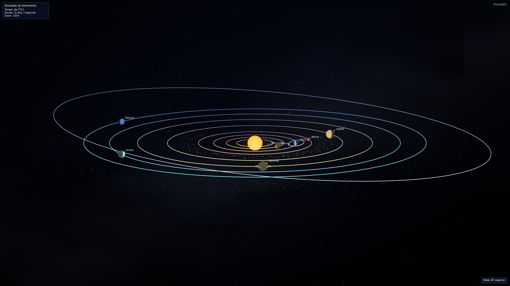

# Astronomia - Simulador Orbital

Simulador do Sistema Solar feito em **MonoGame DesktopGL**, criado para estudar astronomia de forma visual, interativa e experimental.

O projeto combina dois modos principais:

- **Modo 2D superior**: simulacao gravitacional N-corpos com editor de massa e velocidade.
- **Modo inclinado**: visual cinematografico/educacional com shaders, profundidade, orbitas em perspectiva e leitura artistica dos planetas.



## Destaques

- Sol, planetas principais, Lua e Plutao.
- Plutao como planeta anao estudavel, com orbita eliptica e bem inclinada no modo inclinado.
- Motor gravitacional N-corpos no modo 2D.
- Planetas afetam as orbitas uns dos outros.
- Lua incluida na simulacao gravitacional.
- Orbita lunar inclinada no modo inclinado, mostrando que ela nao fica exatamente no plano Terra-Sol.
- Sombras de eclipse entre Terra e Lua quando o alinhamento com o Sol fica favoravel.
- Editor para massa, rotacao e velocidade de translacao no modo 2D.
- Rastros orbitais no modo 2D.
- Modo inclinado com profundidade visual, frente/tras do Sol e ordenacao de corpos.
- Shaders para Sol, planetas, aneis, fundo espacial e poeira solar.
- Planetas com volume guiado pela luz do Sol e camada visual desenhada por cima.
- Atmosferas mais vivas em planetas como Venus, Terra, Urano e Netuno.
- Aneis de Saturno com textura procedural e sombra do planeta nos aneis.
- Aneis de Urano finos, escuros e inclinados, inspirados no sistema real.
- Cinturao principal de asteroides entre Marte e Jupiter.
- Cinturao de Kuiper como faixa fria e dispersa alem de Netuno.
- Fundo inclinado com gradiente espacial, nebulosidade sutil, Via Lactea estilizada, estrelas e paralaxe.
- Labels discretos no modo inclinado.
- Tooltip ao passar o mouse sobre planetas no modo inclinado, com nome, distancia atual e velocidade orbital.
- Painel de estudo com fase visivel aproximada do planeta.
- Painel contextual no modo inclinado com grupo, distancia atual, posicao frente/atras, excentricidade e inclinacao orbital.
- Interface usa fonte Bahnschrift, com leitura mais tecnica/espacial que a fonte padrao.
- Paineis de estudo quebram linhas automaticamente e recalculam a altura para evitar sobreposicao de textos.
- Filtro de centro de massa no modo 2D.
- Captura de tela com `F2`.

## Como Rodar

Requisitos:

- .NET 9 SDK
- MonoGame Content Builder via pacote do projeto

Execute:

```powershell
dotnet restore
dotnet run
```

## Controles

| Acao | Controle |
| --- | --- |
| Pausar/continuar | `Espaco` |
| Aumentar/reduzir escala de tempo | `+` / `-` |
| Reiniciar tempo, zoom e camera | `R` |
| Soltar foco do planeta | `C` |
| Sair | `Esc` |
| Zoom | Scroll do mouse |
| Mover camera | Setas |
| Arrastar camera | Botao direito do mouse |
| Selecionar planeta/Sol | Clique esquerdo |
| Alternar modo 2D/inclinado | Botao no canto inferior direito |
| Salvar print | `F2` |

Os prints sao salvos em:

```text
image/
```

## Modos

### Modo 2D Superior

Modo voltado para simulacao e estudo fisico. Os corpos usam o motor gravitacional, com massas e velocidades editaveis.

Inclui:

- orbitas elipticas;
- rastros reais da simulacao;
- centro de massa;
- editor de massa;
- editor de velocidade de translacao;
- leituras de velocidade, aceleracao, forca gravitacional, distancia ao centro de massa e energia orbital simplificada.

### Modo Inclinado

Modo voltado para leitura visual e apresentacao. Ele usa composicao com `RenderTarget2D` e shaders para criar uma cena mais cinematografica.

Inclui:

- orbitas em perspectiva;
- passagem visual de corpos e orbitas na frente/atras do Sol;
- labels discretos;
- fase visivel estimada;
- poeira solar;
- poeira do plano orbital;
- Via Lactea estilizada;
- paralaxe no fundo;
- aneis de Saturno e Urano;
- cinturao principal de asteroides.

## Shaders

O projeto usa efeitos HLSL/MonoGame:

- `SpaceBackground.fx`: fundo espacial com gradiente, estrelas, nebulosidade, Via Lactea e vinheta.
- `SunGlow.fx`: disco e brilho estilizado do Sol.
- `SolarDust.fx`: poeira radial solar e poeira do plano orbital.
- `ToonPlanet.fx`: planetas com volume e acabamento desenhado.
- `SaturnRings.fx`: aneis de Saturno e Urano com estilos diferentes.
- `SoftCircleMask.fx`: mascara suave para profundidade visual atras de corpos.
- `PassThrough.fx`: composicao final.

## Estrutura

```text
Source/
  Camera/        Camera, zoom e foco
  Interaction/   Selecao por clique
  Models/        Dados de corpos e assets
  Rendering/     Renderizacao, shaders e primitivas
  Simulation/    Motor gravitacional e dados orbitais
  UI/            HUD, painel de estudo e editor

Content/
  Effects/       Shaders .fx
  UiFont.spritefont

image/
  Prints salvos com F2
```

## Objetivo

Este projeto nao busca ser um simulador profissional de astronomia. A proposta e ser uma ferramenta de estudo visual: misturar conceitos reais, simulacao interativa e uma apresentacao bonita o suficiente para tornar o aprendizado mais intuitivo.
